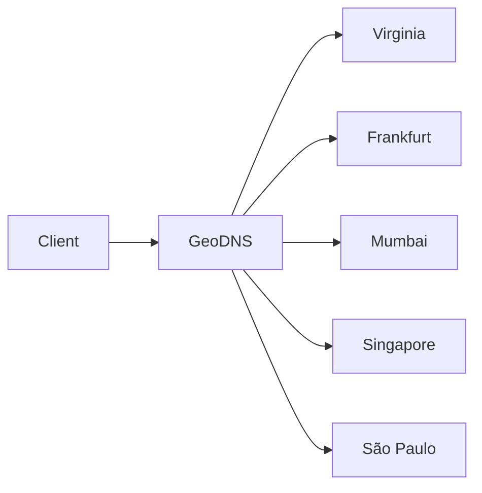

# Проектирование высоконагруженной платформы онлайн-шахмат

## 1. Тема и целевая аудитория

### 1.1. Тема

Проектируется сервис для игры в шахматы онлайн.

Основной аналог - **Chess.com**. Также к сервисам этого типа относится Lichess.

В работе рассматривается только основной игровой функционал. Обучение, боты, трансляции, клубы и другие дополнительные возможности Chess.com в проект не входят.

### 1.2. Целевая аудитория

Chess.com - глобальный сервис.

По отчёту Chess.com за II квартал 2026 года средняя дневная аудитория составляет **10,2 млн DAU**. На 30 июня 2026 года в сервисе было зарегистрировано более **267 млн пользователей** [[1]](#source1).

По данным официальной страницы Chess.com, месячная аудитория сервиса составляет более **50 млн пользователей в месяц** [[2]](#source2).

Аудитория распределена по всему миру. По данным Chess.com за июнь 2026 года, только на США и Индию приходится **84 млн зарегистрированных пользователей**, то есть примерно треть всей пользовательской базы. В России зарегистрировано 8,1 млн пользователей [[3]](#source3).

Для проектирования принимается глобальная аудитория Chess.com.

| Метрика | Значение |
| --- | ---: |
| MAU | 50+ млн |
| Средний DAU | 10,2 млн |
| Зарегистрированные пользователи | 267+ млн |
| География | Международная |

### 1.3. Функционал MVP

В MVP входят основные функции, необходимые для онлайн-игры:

1. Поиск соперника (матчмейкинг с учетом рейтинга пользователя).
2. Проведение партии - сервер принимает ходы, проверяет их и передаёт состояние партии сопернику.
3. Завершение партии (с пересчетом рейтинга и анализом партии).
4. Анализ партии - подсчет точности, подбор лучших ходов в каждой позиции (проводит серверная модель Stockfish).
5. Жалоба на нечестную игру.
6. Просмотр истории партий (с поиском по сопернику, виду партии, контролю времени).

### 1.4. Ключевые продуктовые решения

- Ходы передаются между игроками в реальном времени.
- Шахматные часы считаются на сервере, а не на клиенте.
- Одна завершённая партия хранится один раз и связывается с обоими игроками.
- Анализ сыгранной партии производится 1 раз и хранится.
- Матчмейкинг учитывает рейтинг игрока и выбранный контроль времени.

---

## 2. Расчёт нагрузки

Основные данные Chess.com за 2 квартал 2026 года [[1]](#source1):

- **10,2 млн DAU**;
- **2,8 млрд игр за квартал**;
- **380+ игр/с в пике**;
- **540+ млрд обработанных запросов за квартал**;
- **3,3 млн Fair Play reports за квартал**.

Chess.com не публикует долю игр отдельно от игр с ботами. Поэтому 2,8 млрд используется как верхняя оценка нагрузки.

### 2.1. Продуктовые метрики

#### Аудитория

| Метрика | Значение |
| --- | ---: |
| MAU | 50+ млн [[2]](#source2) |
| Средний DAU | 10,2 млн [[1]](#source1) |
| Зарегистрированные пользователи | 267+ млн [[1]](#source1) |

#### Игры и действия пользователя

Среднее количество партий в сутки (во 2 квартале 2026 года 91 день):

```text
2,8 млрд / 91 = 30,77 млн партий/сутки
```

В одной партии участвуют два игрока:

```text
30,77 млн × 2 / 10,2 млн DAU = 6,03 партии на активного пользователя в день
```

Для расчёта количества ходов принимается стандартная для Chess.com расчётная длина партии — **40 полных ходов**, то есть около **80 полуходов** [[5]](#source5).

```text
30,77 млн × 80 = 2,462 млрд ходов/сутки
```

На одного DAU:

```text
2,462 млрд / 10,2 млн = 241,3 хода/сутки
```

Fair Play:

```text
3,3 млн / 91 = 36,3 тыс. жалоб/сутки
```

```text
36,3 тыс. / 10,2 млн = 0,00356 жалобы на DAU в день
```

Анализ партии - продуктовое решение проекта: **каждая завершённая партия анализируется один раз**, результат сохраняется. Game Review на Chess.com также выполняется на сервере с использованием Stockfish [[6]](#source6).

| Действие | На одного DAU в день | Всего в сутки |
| --- | ---: | ---: |
| Участие в партии | 6,03 | 61,54 млн |
| Отправка хода | 241,3 | 2,462 млрд |
| Завершение партии | 3,02 | 30,77 млн |
| Анализ партии | — | 30,77 млн |
| Fair Play report | 0,00356 | 36,3 тыс. |

#### Просмотр истории и анализа

Chess.com не публикует частоту таких запросов.

Для проектируемого API принимается:

- после завершения партии каждый игрок один раз обновляет историю;
- после готовности анализа каждый игрок один раз получает его результат.

Получаем по две операции чтения на одну завершённую партию:

```text
30,77 млн × 2 = 61,54 млн запросов/сутки
```

для истории и столько же для получения анализа.

### 2.2. Средний объём хранения пользователя

Chess.com сообщает о базе из **30+ млрд партий** [[4]](#source4).

Размер внутренней записи Chess.com не опубликован. Для оценки используется открытый PGN-дамп Lichess. За июнь 2026 года в нём:

- **86 483 328 партий**;
- архив занимает **28,2 ГБ**;
- распакованный PGN примерно в **7,1 раза больше** [[7]](#source7).

Средний логический размер одной партии:

```text
28,2 ГБ × 7,1 / 86 483 328 ≈ 2,315 КБ
```

Объём 30 млрд партий:

```text
30 млрд × 2,315 КБ ≈ 69,45 ТБ
```

Среднее число партий в истории одного зарегистрированного пользователя:

```text
30 млрд × 2 / 267 млн ≈ 224,7 партии
```

Так как одна партия хранится один раз и связывается с двумя игроками, нормированный объём архива на аккаунт:

```text
69,45 ТБ / 267 млн ≈ 0,000260 ГБ ≈ 0,260 МБ
```

#### Результаты анализа

Размер результата анализа Chess.com не публикуется, поэтому используется формат проектируемого сервиса.

Для каждого полухода сохраняются:

- оценка позиции;
- лучший ход;
- класс сыгранного хода.

При 80 полуходах компактный результат анализа принимается равным **512 Б** на партию. Это проектный формат хранения, а не значение Chess.com.

```text
30 млрд × 512 Б = 15,36 ТБ
```

Итого для основных данных MVP:

| Тип данных | Количество | Логический объём |
| --- | ---: | ---: |
| Партии | 30+ млрд | ≈69,45 ТБ |
| Анализы партий | 30+ млрд | ≈15,36 ТБ |
| **Итого** | — | **≈84,81 ТБ** |

В среднем на зарегистрированный аккаунт:

```text
84,81 ТБ / 267 млн ≈ 0,000318 ГБ ≈ 0,318 МБ
```

Это **логический объём данных**. Репликация, индексы, резервные копии и служебные данные здесь не учитываются.

Прирост в сутки:

```text
Партии:
30,77 млн × 2,315 КБ ≈ 71,2 ГБ/сутки

Анализы:
30,77 млн × 512 Б ≈ 15,8 ГБ/сутки

Итого ≈ 87 ГБ/сутки
```

### 2.3. API и RPS

Для среднего RPS:

```text
RPS = число операций в сутки / 86 400
```

Средняя скорость создания партий:

```text
30,77 млн / 86 400 = 356,1 партии/с
```

Chess.com публикует пик **380+ игр/с** [[1]](#source1).

Коэффициент пиковой нагрузки:

```text
Kpeak = 380 / 356,1 ≈ 1,067
```

#### Клиентское API и WebSocket

| Операция | Направление | Что делает | Операций в сутки | Средняя частота | Пик |
| --- | --- | --- | ---: | ---: | ---: |
| `POST /matchmaking/search` | клиент → сервер | Ставит игрока в очередь | 61,54 млн | 712 RPS | 760+ RPS |
| `WS game.move` | клиент → сервер | Передаёт ход | 2,462 млрд | 28 490 EPS | 30 400+ EPS |
| `WS game.end` | сервер → клиент | Передаёт результат и причину завершения: мат, сдача, время, ничья | 61,54 млн | 712 EPS | 760+ EPS |
| `WS game.resign` | клиент → сервер | Игрок сдаётся | ≤30,77 млн | ≤356 EPS | ≤380 EPS |
| `GET /games/history` | клиент → сервер | Возвращает историю с фильтрами | 61,54 млн* | 712 RPS | 760+ RPS |
| `GET /games/{id}/analysis` | клиент → сервер | Возвращает сохранённый анализ | 61,54 млн* | 712 RPS | 760+ RPS |
| `POST /fair-play/reports` | клиент → сервер | Создаёт жалобу | 36,3 тыс. | 0,42 RPS | — |

\* Для истории и анализа принято по одному запросу от каждого игрока после завершения партии.

`game.resign` имеет только верхнюю границу: в одной партии сдаться может не более одного игрока. Доля партий, завершённых сдачей, Chess.com не публикуется.

Мат определяется сервером после `game.move`. Отдельного клиентского запроса для мата нет. После любого завершения сервер отправляет обоим игрокам `game.end`.

Входящий поток без `game.resign`:

```text
712 + 28 490 + 712 + 712 + 0,42 ≈ 30 627 RPS
```

С учётом верхней границы `game.resign`:

```text
≤ 30 983 RPS
```

#### Внутренние операции

После завершения каждой партии сервер выполняет:

| Операция | Средняя частота | Пик |
| --- | ---: | ---: |
| `game.finished` | 356/с | 380+/с |
| Пересчёт рейтинга | 356/с, по 2 игрока | 380+/с |
| Постановка анализа в очередь | 356/с | 380+/с |

При 80 полуходах на партию Stockfish должен обработать:

```text
356,1 × 80 ≈ 28 490 позиций/с
```

В пике:

```text
380 × 80 = 30 400+ позиций/с
```

#### Проверка порядка величины

Chess.com сообщает о **540+ млрд обработанных запросов за Q2** [[1]](#source1):

```text
540 млрд / (91 × 86 400) ≈ 68 681+ запросов/с
```

Наш MVP даёт до **31 тыс. входящих запросов и WS-событий в секунду**. Остальной функционал Chess.com в расчёт не входит.

### 2.4. Сетевой трафик

### 2.4. Сетевой трафик

Размеры сообщений задаются форматом проектируемого API.

| Операция | Размер |
| --- | ---: |
| Matchmaking request/response | ≈192 Б |
| Один ход | ≈208 Б |
| Завершение партии | ≈97 Б на игрока |
| Страница истории, 20 партий | ≈676 Б |
| Результат анализа партии | ≈2,66 КБ |
| Fair Play report | ≈353 Б |

**Matchmaking** содержит идентификатор пользователя, рейтинг и контроль времени. В ответ сервер возвращает `game_id`, данные соперника и цвет фигур.

**Ход** содержит `game_id`, номер хода, начальную и конечную клетки, превращение пешки и время игрока. Учитываются две передачи: игрок → сервер и сервер → соперник.

**Завершение партии** содержит `game_id`, результат, причину завершения и изменение рейтинга. Сообщение отправляется обоим игрокам.

**История партий** возвращает до 20 записей: идентификатор партии, соперника, дату, результат, рейтинг и контроль времени.

**Анализ партии** содержит данные примерно для 80 позиций. Для каждой позиции сохраняются оценка, класс хода, лучший ход и линия Stockfish примерно на 12 полуходов. Полезная нагрузка анализа составляет около **2,5 КБ**. С учётом сетевых заголовков — около **2,66 КБ**.

**Fair Play report** содержит `game_id`, пользователя, причину жалобы и текстовый комментарий.

В размер сетевого сообщения включаются заголовки Ethernet, IPv4, TCP, TLS и WebSocket. Для HTTP-запросов размер заголовков зависит от реализации, поэтому расчёт остаётся приблизительным.

#### Суточный и пиковый трафик

| Тип трафика | За сутки | Пиковая полоса |
| --- | ---: | ---: |
| Matchmaking | ≈11,8 ГБ | ≈0,0012 Гбит/с |
| Ходы | ≈512 ГБ | ≈0,0506 Гбит/с |
| Завершение партии | ≈6,0 ГБ | ≈0,0006 Гбит/с |
| История партий | ≈41,6 ГБ | ≈0,0041 Гбит/с |
| Анализ партии | ≈163,7 ГБ | ≈0,0162 Гбит/с |
| Fair Play | ≈0,01 ГБ | <0,0001 Гбит/с |
| **Итого** | **≈735,1 ГБ/сутки** | **≈0,0727 Гбит/с** |

Основной сетевой трафик создают ходы и передача результатов анализа.

---

## 3. Глобальная балансировка нагрузки

### 3.1. Функциональное разбиение по доменам

| Домен | Назначение | Средняя нагрузка |
| --- | --- | ---: |
| `play.chess.example` | Матчмейкинг и игровые WebSocket-сессии | ≈29,2 тыс. RPS/EPS + `resign` ≤356 EPS |
| `api.chess.example` | История, анализ, Fair Play | ≈1,42 тыс. RPS |

### 3.2. Расположение ДЦ

Chess.com имеет международную аудиторию. США и Индия вместе дают **84 млн зарегистрированных пользователей** [[3]](#source3). Пользователи также распределены по Европе, Юго-Восточной Азии и Южной Америке.

Для проекта выбираются пять ДЦ:

| ДЦ | Регион |
| --- | --- |
| Virginia | Северная Америка |
| Frankfurt | Европа |
| Mumbai | Индия |
| Singapore | Юго-Восточная Азия |
| São Paulo | Южная Америка |

Несколько ДЦ нужны для уменьшения задержки во время партии. Игровая сессия должна обслуживаться одним ДЦ до завершения.

<!-- ### 3.3. Распределение запросов

Chess.com не публикует DAU по регионам, поэтому точное распределение RPS между ДЦ не рассчитывается.

Новые пользователи направляются в ближайший доступный ДЦ. При создании партии матчмейкинг выбирает игровой ДЦ, приемлемый для обоих игроков.

Общая нагрузка, которую необходимо распределить:

| Тип | Средняя нагрузка | Пик |
| --- | ---: | ---: |
| `play.chess.example` | ≈29,2 тыс. + `resign` ≤356 | ≈31,2 тыс. + `resign` ≤380 |
| `api.chess.example` | ≈1,42 тыс. | ≈1,52 тыс.* |

\* Без Fair Play, для которого пиковая частота не опубликована.

### 3.4. DNS-балансировка

Для обоих доменов используется GeoDNS.



GeoDNS возвращает адрес ближайшего доступного ДЦ.

После начала партии WebSocket остаётся привязан к выбранному игровому ДЦ.

### 3.5. Anycast

Anycast не используется.

Для первичного подключения достаточно GeoDNS. Игровое соединение stateful и после начала партии не должно менять ДЦ.

### 3.6. Регулировка трафика между ДЦ

При недоступности ДЦ:

1. ДЦ исключается из GeoDNS для новых подключений.
2. Новые HTTP-запросы направляются в соседний доступный регион.
3. Новые партии создаются в другом игровом ДЦ.
4. Уже начатая партия штатно между ДЦ не переносится.

Восстановление активной партии после отказа ДЦ рассматривается в разделе надёжности. -->

---

## Список источников

1. <a id="source1"></a>[Chess.com - The Board Report, Q2 2026](https://www.chess.com/board-reports/2026-q2) - 10,2 млн DAU, 267+ млн пользователей, 2,8 млрд игр за Q2, 380+ игр/с в пике, 540+ млрд обработанных запросов и 3,3 млн Fair Play reports.

2. <a id="source2"></a>[Chess.com - Partner with Chess.com](https://www.chess.com/article/view/partner-with-chesscom) - 50+ млн MAU.

3. <a id="source3"></a>[Chess.com - Countries That Love Online Chess The Most](https://www.chess.com/article/view/chess-countries) - география аудитории.

4. <a id="source4"></a>[Chess.com - Access The World's Largest Chess Database With Over 30 Billion Games](https://www.chess.com/news/view/announcing-chesscom-games-database) - база из 30+ млрд партий.

5. <a id="source5"></a>[Chess.com - Chess Clocks: An Introduction](https://www.chess.com/article/view/an-introduction-to-chess-clocks) - Chess.com использует 40 ходов как расчётную длину партии при определении time control.

6. <a id="source6"></a>[Chess.com Help - How does Game Review work?](https://support.chess.com/en/articles/8584089-how-does-game-review-work) и [How do the chess engines on Chess.com work?](https://support.chess.com/en/articles/9462780-how-do-the-chess-engines-on-chess-com-work) - Game Review выполняется на сервере; серверный движок - Stockfish.

7. <a id="source7"></a>[Lichess Open Database](https://database.lichess.org/) - за июнь 2026 года: 86 483 328 стандартных рейтинговых партий, 28,2 ГБ в сжатом виде; распакованный PGN примерно в 7,1 раза больше.

8. <a id="source8"></a>[Chess.com Help - How do I view my own games?](https://support.chess.com/en/articles/8598090-how-do-i-view-my-own-games) - история игр и фильтрация по дате, контролю времени, сопернику, результату и типу игры.

9. <a id="source9"></a>[Chess.com Help - How does matchmaking work in Live Chess?](https://support.chess.com/en/articles/8639319-how-does-matchmaking-work-in-live-chess) - матчмейкинг по рейтинговому диапазону и контролю времени.
