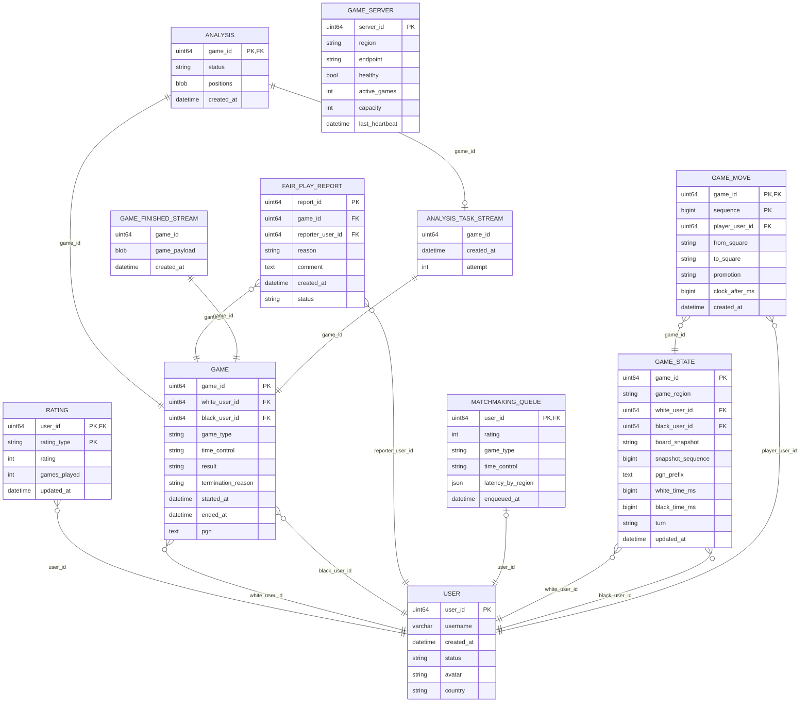
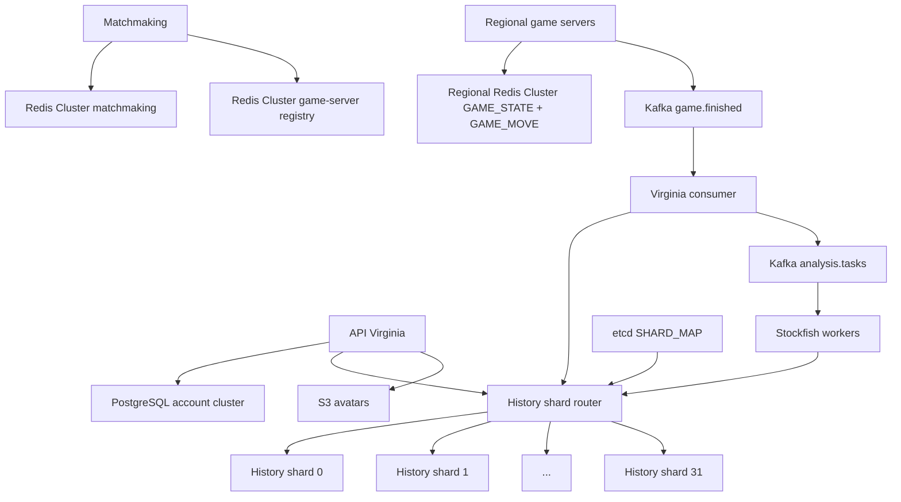

# Проектирование высоконагруженной платформы онлайн-шахмат

## 1. Тема и целевая аудитория

### 1.1. Тема

Проектируется сервис для игры в шахматы онлайн.

Основной аналог - **Chess.com**. Также к сервисам этого типа относится Lichess.

В работе рассматривается только основной игровой функционал. Обучение, боты, трансляции, клубы и другие дополнительные возможности Chess.com в проект не входят.

### 1.2. Целевая аудитория

Chess.com - глобальный сервис.

По отчёту Chess.com за II квартал 2026 года средняя дневная аудитория составляет **10,2 млн DAU**. На 30 июня 2026 года в сервисе было зарегистрировано более **267 млн пользователей** [[1]](#source1).

По данным официальной страницы Chess.com, месячная аудитория сервиса составляет более **50 млн пользователей в месяц** [[2]](#source2).

Аудитория распределена по всему миру. По данным Chess.com за июнь 2026 года, только на США и Индию приходится **84 млн зарегистрированных пользователей**, то есть примерно треть всей пользовательской базы. В России зарегистрировано 8,1 млн пользователей [[3]](#source3).

Для проектирования принимается глобальная аудитория Chess.com.

| Метрика | Значение |
| --- | ---: |
| MAU | 50+ млн |
| Средний DAU | 10,2 млн |
| Зарегистрированные пользователи | 267+ млн |
| География | Международная |

### 1.3. Функционал MVP

В MVP входят основные функции, необходимые для онлайн-игры:

1. Поиск соперника (матчмейкинг с учетом рейтинга пользователя).
2. Проведение партии - сервер принимает ходы, проверяет их и передаёт состояние партии сопернику.
3. Завершение партии (с пересчетом рейтинга и анализом партии).
4. Анализ партии - подсчет точности, подбор лучших ходов в каждой позиции (проводит серверная модель Stockfish).
5. Жалоба на нечестную игру.
6. Просмотр истории партий (с поиском по сопернику, виду партии, контролю времени).

### 1.4. Ключевые продуктовые решения

- Ходы передаются между игроками в реальном времени.
- Шахматные часы считаются на сервере, а не на клиенте.
- Одна завершённая партия хранится один раз и связывается с обоими игроками.
- Анализ сыгранной партии производится 1 раз и хранится.
- Матчмейкинг учитывает рейтинг игрока и выбранный контроль времени.

---

## 2. Расчёт нагрузки

Основные данные Chess.com за 2 квартал 2026 года [[1]](#source1):

- **10,2 млн DAU**;
- **2,8 млрд игр за квартал**;
- **380+ игр/с в пике**;
- **540+ млрд обработанных запросов за квартал**;
- **3,3 млн Fair Play reports за квартал**.

Chess.com не публикует долю игр отдельно от игр с ботами. Поэтому 2,8 млрд используется как верхняя оценка нагрузки.

### 2.1. Продуктовые метрики

#### Аудитория

| Метрика | Значение |
| --- | ---: |
| MAU | 50+ млн [[2]](#source2) |
| Средний DAU | 10,2 млн [[1]](#source1) |
| Зарегистрированные пользователи | 267+ млн [[1]](#source1) |

#### Игры и действия пользователя

Среднее количество партий в сутки (во 2 квартале 2026 года 91 день):

```text
2,8 млрд / 91 = 30,77 млн партий/сутки
```

В одной партии участвуют два игрока:

```text
30,77 млн × 2 / 10,2 млн DAU = 6,03 партии на активного пользователя в день
```

Для расчёта количества ходов принимается стандартная для Chess.com расчётная длина партии — **40 полных ходов**, то есть около **80 полуходов** [[5]](#source5).

```text
30,77 млн × 80 = 2,462 млрд ходов/сутки
```

На одного DAU:

```text
2,462 млрд / 10,2 млн = 241,3 хода/сутки
```

Fair Play:

```text
3,3 млн / 91 = 36,3 тыс. жалоб/сутки
```

```text
36,3 тыс. / 10,2 млн = 0,00356 жалобы на DAU в день
```

Анализ партии - продуктовое решение проекта: **каждая завершённая партия анализируется один раз**, результат сохраняется. Game Review на Chess.com также выполняется на сервере с использованием Stockfish [[6]](#source6).

| Действие | На одного DAU в день | Всего в сутки |
| --- | ---: | ---: |
| Участие в партии | 6,03 | 61,54 млн |
| Отправка хода | 241,3 | 2,462 млрд |
| Завершение партии | 3,02 | 30,77 млн |
| Анализ партии | — | 30,77 млн |
| Fair Play report | 0,00356 | 36,3 тыс. |

#### Просмотр истории и анализа

Chess.com не публикует частоту таких запросов.

Для проектируемого API принимается:

- после завершения партии каждый игрок один раз обновляет историю;
- после готовности анализа каждый игрок один раз получает его результат.

Получаем по две операции чтения на одну завершённую партию:

```text
30,77 млн × 2 = 61,54 млн запросов/сутки
```

для истории и столько же для получения анализа.

### 2.2. Средний объём хранения пользователя

Chess.com сообщает о базе из **30+ млрд партий** [[4]](#source4).

Размер внутренней записи Chess.com не опубликован. Для оценки используется открытый PGN-дамп Lichess. За июнь 2026 года в нём:

- **86 483 328 партий**;
- архив занимает **28,2 ГБ**;
- распакованный PGN примерно в **7,1 раза больше** [[7]](#source7).

Средний логический размер одной партии:

```text
28,2 ГБ × 7,1 / 86 483 328 ≈ 2,315 КБ
```

Объём 30 млрд партий:

```text
30 млрд × 2,315 КБ ≈ 69,45 ТБ
```

Среднее число партий в истории одного зарегистрированного пользователя:

```text
30 млрд × 2 / 267 млн ≈ 224,7 партии
```

Так как одна партия хранится один раз и связывается с двумя игроками, нормированный объём архива на аккаунт:

```text
69,45 ТБ / 267 млн ≈ 0,000260 ГБ ≈ 0,260 МБ
```

#### Результаты анализа

Размер результата анализа Chess.com не публикуется, поэтому используется формат проектируемого сервиса.

Для каждой позиции сохраняются:

- оценка позиции;
- класс сыгранного хода;
- лучший ход;
- линия Stockfish примерно на 12 полуходов.

При анализе примерно 80 позиций полезная нагрузка результата анализа принимается равной **≈2,5 КБ** на партию. Это проектный формат хранения, а не значение Chess.com.

```text
30 млрд × 2,5 КБ ≈ 75 ТБ
```

Итого для основных данных MVP:

| Тип данных | Количество | Логический объём |
| --- | ---: | ---: |
| Партии | 30+ млрд | ≈69,45 ТБ |
| Анализы партий | 30+ млрд | ≈75 ТБ |
| **Итого** | — | **≈144,45 ТБ** |

В среднем на зарегистрированный аккаунт:

```text
144,45 ТБ / 267 млн ≈ 0,000541 ГБ ≈ 0,541 МБ
```

Это **логический объём данных**. Репликация, индексы, резервные копии и служебные данные здесь не учитываются.

Прирост в сутки:

```text
Партии:
30,77 млн × 2,315 КБ ≈ 71,2 ГБ/сутки

Анализы:
30,77 млн × 2,5 КБ ≈ 76,9 ГБ/сутки

Итого ≈ 148,1 ГБ/сутки
```

### 2.3. API и RPS

Для среднего RPS:

```text
RPS = число операций в сутки / 86 400
```

Средняя скорость создания партий:

```text
30,77 млн / 86 400 = 356,1 партии/с
```

Chess.com публикует пик **380+ игр/с** [[1]](#source1).

Коэффициент пиковой нагрузки:

```text
Kpeak = 380 / 356,1 ≈ 1,067
```

#### Клиентское API и WebSocket

| Операция | Направление | Что делает | Операций в сутки | Средняя частота | Пик |
| --- | --- | --- | ---: | ---: | ---: |
| `POST /matchmaking/search` | клиент → сервер | Ставит игрока в очередь | 61,54 млн | 712 RPS | 760+ RPS |
| `WS game.move` | клиент → сервер | Передаёт ход | 2,462 млрд | 28 490 EPS | 30 400+ EPS |
| `WS game.end` | сервер → клиент | Передаёт результат и причину завершения: мат, сдача, время, ничья | 61,54 млн | 712 EPS | 760+ EPS |
| `WS game.resign` | клиент → сервер | Игрок сдаётся | ≤30,77 млн | ≤356 EPS | ≤380 EPS |
| `GET /games/history` | клиент → сервер | Возвращает историю с фильтрами | 61,54 млн* | 712 RPS | 760+ RPS |
| `GET /games/{id}/analysis` | клиент → сервер | Возвращает сохранённый анализ | 61,54 млн* | 712 RPS | 760+ RPS |
| `POST /fair-play/reports` | клиент → сервер | Создаёт жалобу | 36,3 тыс. | 0,42 RPS | — |

\* Для истории и анализа принято по одному запросу от каждого игрока после завершения партии.

`game.resign` имеет только верхнюю границу: в одной партии сдаться может не более одного игрока. Доля партий, завершённых сдачей, Chess.com не публикуется.

Мат определяется сервером после `game.move`. Отдельного клиентского запроса для мата нет. После любого завершения сервер отправляет обоим игрокам `game.end`.

Входящий поток без `game.resign`:

```text
712 + 28 490 + 712 + 712 + 0,42 ≈ 30 627 RPS
```

С учётом верхней границы `game.resign`:

```text
≤ 30 983 RPS
```

#### Внутренние операции

После завершения каждой партии сервер выполняет:

| Операция | Средняя частота | Пик |
| --- | ---: | ---: |
| `game.finished` | 356/с | 380+/с |
| Пересчёт рейтинга | 356/с, по 2 игрока | 380+/с |
| Постановка анализа в очередь | 356/с | 380+/с |

При 80 полуходах на партию Stockfish должен обработать:

```text
356,1 × 80 ≈ 28 490 позиций/с
```

В пике:

```text
380 × 80 = 30 400+ позиций/с
```

#### Проверка порядка величины

Chess.com сообщает о **540+ млрд обработанных запросов за Q2** [[1]](#source1):

```text
540 млрд / (91 × 86 400) ≈ 68 681+ запросов/с
```

Наш MVP даёт до **31 тыс. входящих запросов и WS-событий в секунду**. Остальной функционал Chess.com в расчёт не входит.

### 2.4. Сетевой трафик

Размеры сообщений задаются форматом проектируемого API.

| Операция | Размер |
| --- | ---: |
| Matchmaking request/response | ≈192 Б |
| Один ход | ≈208 Б |
| Завершение партии | ≈97 Б на игрока |
| Страница истории, 20 партий | ≈676 Б |
| Результат анализа партии | ≈2,66 КБ |
| Fair Play report | ≈353 Б |

**Matchmaking** содержит идентификатор пользователя, рейтинг и контроль времени. В ответ сервер возвращает `game_id`, данные соперника и цвет фигур.

**Ход** содержит `game_id`, номер хода, начальную и конечную клетки, превращение пешки и время игрока. Учитываются две передачи: игрок → сервер и сервер → соперник.

**Завершение партии** содержит `game_id`, результат, причину завершения и изменение рейтинга. Сообщение отправляется обоим игрокам.

**История партий** возвращает до 20 записей: идентификатор партии, соперника, дату, результат, рейтинг и контроль времени.

**Анализ партии** содержит данные примерно для 80 позиций. Для каждой позиции сохраняются оценка, класс хода, лучший ход и линия Stockfish примерно на 12 полуходов. Полезная нагрузка анализа составляет около **2,5 КБ**. С учётом сетевых заголовков — около **2,66 КБ**.

**Fair Play report** содержит `game_id`, пользователя, причину жалобы и текстовый комментарий.

В размер сетевого сообщения включаются заголовки Ethernet, IPv4, TCP, TLS и WebSocket. Для HTTP-запросов размер заголовков зависит от реализации, поэтому расчёт остаётся приблизительным.

#### Суточный и пиковый трафик

| Тип трафика | За сутки | Пиковая полоса |
| --- | ---: | ---: |
| Matchmaking | ≈11,8 ГБ | ≈0,0012 Гбит/с |
| Ходы | ≈512 ГБ | ≈0,0506 Гбит/с |
| Завершение партии | ≈6,0 ГБ | ≈0,0006 Гбит/с |
| История партий | ≈41,6 ГБ | ≈0,0041 Гбит/с |
| Анализ партии | ≈163,7 ГБ | ≈0,0162 Гбит/с |
| Fair Play | ≈0,01 ГБ | <0,0001 Гбит/с |
| **Итого** | **≈735,1 ГБ/сутки** | **≈0,0727 Гбит/с** |

Основной сетевой трафик создают ходы и передача результатов анализа.

---

## 3. Глобальная балансировка нагрузки

### 3.1. Функциональное разбиение по доменам

| Домен | Назначение |
| --- | --- |
| `api.chess.example` | матчмейкинг, история партий, анализ, Fair Play |
| `game-{region}.chess.example` | игровые WebSocket-соединения |

Матчмейкинг специально вынесен из игрового сервиса для создания легковесных игровых обработчиков.

### 3.2. Расположение ДЦ

Chess.com имеет международную аудиторию. Крупнейшие группы пользователей находятся в США, Индии, Европе, Юго-Восточной Азии и Южной Америке [[3]](#source3).

Для проекта выбираются пять ДЦ:

| ДЦ | Регион |
| --- | --- |
| Virginia | Северная Америка |
| Frankfurt | Европа |
| Mumbai | Индия |
| Singapore | Юго-Восточная Азия |
| São Paulo | Южная Америка |

Региональные игровые серверы нужны для уменьшения задержки между игроком и сервером во время партии.

### 3.3. Глобальная балансировка

```text
api.chess.example → Virginia → API
```

Все обычные API-запросы идут в Virginia. После подбора двух игроков matchmaking выбирает один игровой ДЦ и возвращает клиентам адрес соответствующего игрового endpoint:

```text
game-{region}.chess.example
```

Выбор игрового региона выполняется по latency обоих игроков и текущей загрузке игровых регионов. После этого игровой трафик идёт напрямую в выбранный ДЦ и не проходит через Virginia API.

Преимущество решения - единая точка для API, истории и рейтингов без необходимости поддерживать региональные API-кластеры и региональные read-replica только ради клиентского чтения. Дополнительная задержка до Virginia допустима для обычных HTTP-запросов. Критичный к latency поток ходов после matchmaking работает внутри выбранного игрового региона.

### 3.4. Распределение нагрузки

Из раздела 2:

| Операция | Средняя нагрузка | Пиковая нагрузка |
| --- | ---: | ---: |
| Matchmaking | 712 RPS | 760+ RPS |
| Ходы | 28 490 EPS | 30 400+ EPS |
| Завершение партии | 712 EPS | 760+ EPS |
| Сигнал досрочной сдачи | ≤356 EPS | ≤380 EPS |
| История партий | 712 RPS | 760+ RPS |
| Получение анализа | 712 RPS | 760+ RPS |
| Fair Play | 0,42 RPS | - |

Нагрузка на `api.chess.example` составляет около **2,14 тыс. RPS** в среднем без учёта игровых событий. Основная нагрузка на игровые регионы - **28,49 тыс. ходов/с** в среднем.

Chess.com не публикует DAU по регионам, поэтому точное распределение RPS между ДЦ не рассчитывается.

Все API-запросы направляются в Virginia. Игровая нагрузка распределяется матчмейкером между региональными игровыми кластерами.

### 3.5. Размещение данных

Постоянное хранилище истории представляет собой один логический кластер, размещенный в Virginia.

После завершения партии игровой сервер публикует событие с итоговыми данными партии. Потребитель в Virginia сохраняет партию, инициирует пересчёт рейтинга и ставит анализ в очередь.

```text
game server
    ↓
Kafka: game.finished
    ↓
consumer in Virginia
    ├── сохранение партии
    ├── пересчёт рейтинга
    └── analysis task
```

Средняя частота событий:

```text
≈356 событий/с
```

Пиковая:

```text
≈380 событий/с
```

Для оценки сообщения принимается размер около `2,5 КБ`: данные партии `≈2,315 КБ` плюс служебные поля события.

```text
356 × 2,5 КБ ≈ 0,89 МБ/с
380 × 2,5 КБ ≈ 0,95 МБ/с
```

Такой поток невелик. Kafka здесь нужна не ради пропускной способности, а как долговечный буфер между игровыми регионами и обработчиками в Virginia. Повторная доставка допустима, поэтому запись партии должна быть идемпотентной по `game_id`.

### 3.6. Anycast

Anycast не используется. API имеет единую точку входа в Virginia, а конкретный игровой регион выбирается матчмейкером. Игровое WebSocket-соединение после начала партии привязано к конкретному региону.

---

## 4. Локальная балансировка нагрузки

### 4.1. Схема балансировки

Внутри каждого ДЦ используется **L7-балансировка на NGINX**. L7 выбран, так как позволяет терминировать TLS, маршрутизировать HTTP/WebSocket по домену и URI и применять разные алгоритмы балансировки для API и игровых соединений.

Для внешнего и межсервисного HTTP/gRPC-трафика используется одна пара NGINX с двумя логическими входами: публичным и внутренним VIP (Virtual IP).

Для `api.chess.example` и внутренних HTTP/gRPC-вызовов используется `least_conn (least connections)`: запрос передаётся экземпляру с наименьшим числом активных соединений.

Для `game-{region}.chess.example` NGINX проксирует WebSocket. Игровой backend выбирается через consistent hash по `game_id`: `hash(game_id) -> game server`

Это направляет подключения обоих игроков одной партии на один игровой сервер.

Очереди сообщений и подключения к БД не относятся к HTTP L7-балансировке и балансируются средствами соответствующих компонентов.

### 4.2. SSL termination

TLS завершается на внешнем L7-балансировщике.

Пиковая скорость создания партий: `380 партий/с`

Для каждой партии два игрока устанавливают игровое соединение: `380 × 2 = 760 новых WebSocket-соединений/с`

Для верхней оценки считаем, что пиковые HTTP-запросы также создают новое TLS-соединение:

```text
matchmaking: 760 соединений/с
history:     760 соединений/с
analysis:    760 соединений/с
WebSocket:   760 соединений/с

Итого ≈ 3 040 TLS handshakes/с
```

На практике нагрузка будет ниже из-за HTTP keep-alive и повторного использования TLS-сессий.

В тесте NGINX Ingress Controller конфигурация с 8 CPU без Hyper-Threading обработала **31 485 новых SSL/TLS-соединений/с** при RSA-2048 и PFS [[10]](#source10).

Количество рабочих балансировщиков по SSL termination:

```text
N_SSL = ceil(3 040 / 31 485) = 1
```

Запас по SSL:

```text
3 040 / 31 485 ≈ 9,7 %
```

Следовательно, одного рабочего L7-балансировщика достаточно даже при консервативной оценке полной пиковой нагрузки проекта. С резервированием N*2 требуется:

```text
2 NGINX-балансировщика на ДЦ
```

Для пяти ДЦ:

```text
5 × 2 = 10 NGINX-балансировщиков
```

Расчёт выполнен по полной пиковой нагрузке проекта для каждого ДЦ, поэтому не требует неподтверждённого распределения DAU по регионам.

### 4.3. Отказоустойчивость

Балансировщики резервируются по схеме **N * 2**.

По расчёту SSL termination одному ДЦ достаточно одного рабочего L7-балансировщика:

```text
N = 1
```

Следовательно:

```text
N_total = 1 × 2 = 2 балансировщика на ДЦ
```

При пяти ДЦ:

```text
5 × 2 = 10 NGINX-балансировщиков
```

NGINX работают в режиме active/standby. Public VIP и Internal VIP переключаются между ними через VRRP/Keepalived.

Keepalived контролирует доступность активного NGINX. При отказе узла VRRP переносит VIP на standby-реплику. Недоступный экземпляр исключается из балансировки, новые запросы направляются на оставшиеся узлы.

При отказе самого балансировщика существующие TCP/WebSocket-соединения разрываются. После переключения VIP клиенты устанавливают соединение заново. Восстановление состояния активной партии рассматривается в разделе обеспечения надёжности.

---

# 5. Логическая схема базы данных

В разделе описываются логические сущности и потоки данных без привязки к конкретной СУБД, схеме шардинга и физическому размещению.

## 5.1. Идентификаторы

Автоинкрементные идентификаторы не используются для сущностей, которые потенциально создаются на разных узлах.

Независимые шарды могут генерировать пересекающиеся последовательности, а единый центральный sequence создаёт дополнительную точку синхронизации.

Для `user_id`, `game_id`, `report_id` и `server_id` используется 64-битный распределённый идентификатор:

```text
timestamp | worker_id | sequence
```

Размер идентификатора — `8 Б`.

Он генерируется без обращения к центральной БД, уникален между узлами, приблизительно сортируется по времени создания и занимает в два раза меньше места, чем бинарный UUID (`16 Б`).

## 5.2. Логическая схема


```mermaid
erDiagram
    USER {
        uint64 user_id PK
        varchar username
        datetime created_at
        string status
        string avatar
        string country
    }

    RATING {
        uint64 user_id PK,FK
        string rating_type PK
        int rating
        int games_played
        datetime updated_at
    }

    GAME {
        uint64 game_id PK
        uint64 white_user_id FK
        uint64 black_user_id FK
        string game_type
        string time_control
        string result
        string termination_reason
        datetime started_at
        datetime ended_at
        text pgn
    }

    ANALYSIS {
        uint64 game_id PK,FK
        string status
        blob positions
        datetime created_at
    }

    FAIR_PLAY_REPORT {
        uint64 report_id PK
        uint64 game_id FK
        uint64 reporter_user_id FK
        string reason
        text comment
        datetime created_at
        string status
    }

    MATCHMAKING_QUEUE {
        uint64 user_id PK,FK
        int rating
        string game_type
        string time_control
        json latency_by_region
        datetime enqueued_at
    }

    GAME_STATE {
        uint64 game_id PK
        string game_region
        uint64 white_user_id FK
        uint64 black_user_id FK
        string board_snapshot
        bigint snapshot_sequence
        text pgn_prefix
        bigint white_time_ms
        bigint black_time_ms
        string turn
        datetime updated_at
    }

    GAME_MOVE {
        uint64 game_id PK,FK
        bigint sequence PK
        uint64 player_user_id FK
        string from_square
        string to_square
        string promotion
        bigint clock_after_ms
        datetime created_at
    }

    GAME_SERVER {
        uint64 server_id PK
        string region
        string endpoint
        bool healthy
        int active_games
        int capacity
        datetime last_heartbeat
    }

    GAME_FINISHED_STREAM {
        uint64 game_id
        blob game_payload
        datetime created_at
    }

    ANALYSIS_TASK_STREAM {
        uint64 game_id
        datetime created_at
        int attempt
    }

    RATING }o--|| USER : "user_id"
    GAME }o--|| USER : "white_user_id"
    GAME }o--|| USER : "black_user_id"
    ANALYSIS ||--|| GAME : "game_id"
    FAIR_PLAY_REPORT }o--|| GAME : "game_id"
    FAIR_PLAY_REPORT }o--|| USER : "reporter_user_id"
    MATCHMAKING_QUEUE o|--|| USER : "user_id"
    GAME_STATE }o--|| USER : "white_user_id"
    GAME_STATE }o--|| USER : "black_user_id"
    GAME_MOVE }o--|| GAME_STATE : "game_id"
    GAME_MOVE }o--|| USER : "player_user_id"
    GAME_FINISHED_STREAM ||--|| GAME : "game_id"
    ANALYSIS_TASK_STREAM ||--|| GAME : "game_id"
    ANALYSIS ||--o| ANALYSIS_TASK_STREAM : "game_id"
```

`GAME_SERVER` не связан внешним ключом с партией. Он является реестром игровых узлов. Matchmaking использует его для оценки доступности и загрузки регионов, а конкретный backend внутри выбранного региона определяется L7-балансировщиком по `game_id`.

## 5.3. Хранение ходов и состояния активной партии

Каждый подтверждённый полуход сначала сохраняется в `GAME_MOVE`.

```text
WS game.move
    ↓
GAME_MOVE
```

`GAME_STATE` содержит периодический snapshot, а не состояние после каждого последнего хода:

Актуальная позиция восстанавливается так:

```text
GAME_STATE.board_snapshot
        +
GAME_MOVE where sequence > snapshot_sequence
        ↓
актуальное состояние доски
```

Поэтому после отказа игрового сервера другой узел может восстановить партию только по данным хранилища.

### Компактизация ходов

Через каждые `K` новых полуходов хвост `GAME_MOVE` переносится в `GAME_STATE`.

Для расчётов принимается: `K = 10 полуходов`

Обновление snapshot и удаление перенесённых ходов должны выполняться атомарно относительно одной партии. Нельзя удалить `GAME_MOVE`, пока новый `GAME_STATE` не подтверждён.

После компактизации в `GAME_MOVE` остаётся только хвост последних ходов.

### Завершение партии

```text
GAME_STATE
    +
оставшиеся GAME_MOVE
    ↓
полный PGN
    ↓
Kafka: game.finished
    ↓
GAME
```

После подтверждённого сохранения `GAME` временные `GAME_STATE` и `GAME_MOVE` удаляются.

Таким образом, каждый ход фиксируется отдельно, полный snapshot не переписывается после каждого полухода. В случае отказа game-server партия восстанавливается из `GAME_STATE + GAME_MOVE`.

## 5.4. Реестр игровых серверов

`GAME_SERVER` содержит текущее состояние игровых узлов:

| Поле | Назначение |
| --- | --- |
| `server_id` | глобальный идентификатор узла |
| `region` | игровой регион |
| `endpoint` | внутренний адрес |
| `healthy` | допускается ли узел к новым подключениям |
| `active_games` | число активных партий |
| `capacity` | расчётная вместимость |
| `last_heartbeat` | время последнего heartbeat |

Matchmaking использует агрегированное состояние серверов для выбора игрового региона. Конкретный game-server внутри региона выбирает L7-балансировщик через consistent hash по `game_id`.

Если heartbeat не поступает дольше заданного timeout, сервер считается `unhealthy`.

## 5.5. Описание сущностей

| Сущность | Назначение |
| --- | --- |
| `USER` | Учётная запись пользователя |
| `RATING` | Рейтинг пользователя по типам партий |
| `GAME` | Постоянная запись завершённой партии и PGN |
| `ANALYSIS` | Сохранённый результат Stockfish |
| `FAIR_PLAY_REPORT` | Жалоба на конкретную партию |
| `MATCHMAKING_QUEUE` | Игроки, ожидающие соперника |
| `GAME_STATE` | Последний подтверждённый snapshot активной партии |
| `GAME_MOVE` | Хвост ходов после последнего snapshot |
| `GAME_SERVER` | Реестр игровых узлов, их health и загрузки |
| `GAME_FINISHED_STREAM` | Kafka-поток завершённых партий |
| `ANALYSIS_TASK_STREAM` | Kafka-поток задач Stockfish |

## 5.6. Размеры данных и нагрузка

Для snapshot принимается `K = 10`.

| Сущность | Количество и размер | Чтение | Запись |
| --- | --- | ---: | ---: |
| `USER` | 267+ млн строк; `≈96 Б/строка` без файла аватара | не менее `≈712 QPS` для matchmaking | регистрация не входит в рассчитанный MVP |
| `RATING` | `267 млн × K_rating`; `≈32 Б/строка` | `≈712 QPS` | `≈712 updates/с`, пик `≈760/с` |
| `GAME` | 30+ млрд; `≈2,315 КБ/партия`; `≈69,45 ТБ` | history `≈712 QPS` | `≈356 inserts/с`, пик `≈380/с` |
| `ANALYSIS` | до 30+ млрд; `≈2,5 КБ/строка`; `≈75 ТБ` | `≈712 QPS` | `≈356 results/с`, пик `≈380/с` |
| `FAIR_PLAY_REPORT` | `36,3 тыс./сутки`; `≈512 Б/строка` | клиентское чтение не входит в MVP | `≈0,42 inserts/с` |
| `MATCHMAKING_QUEUE` | `≈712 × W` активных записей | зависит от алгоритма | `≈712 enqueue/с + 712 dequeue/с` |
| `GAME_MOVE` | не более `K-1` неслитых строк на активную партию; `≈64 Б/строка` | при реконструкции до `K-1` строк; при компактизации `≈28 490 row reads/с`, пик `≈30 400/с` | `≈28 490 inserts/с`, пик `≈30 400+/с`; batch-delete `≈2 849 ops/с`, пик `≈3 040/с` |
| `GAME_STATE` | одна запись на активную партию; несколько КБ с `pgn_prefix` | чтение при реконструкции, reconnect, failover и компактизации | при `K=10`: `≈2 849 updates/с`, пик `≈3 040/с` |
| `GAME_SERVER` | число игровых серверов | читается matchmaking/control-plane | `S/H` heartbeat updates/с |
| `GAME_FINISHED_STREAM` | `≈2,5 КБ/event` | `≈356 msg/с` | `≈356 msg/с`, пик `≈380/с` |
| `ANALYSIS_TASK_STREAM` | `≈64 Б/event` | `≈356 msg/с` | `≈356 msg/с`, пик `≈380/с` |

Где:

```text
K = 10 — число ходов между snapshot;
K_rating — число рейтинговых категорий;
W — среднее время ожидания matchmaking;
S — количество игровых серверов;
H — интервал heartbeat в секундах.
```


---

# 6. Физическая схема базы данных

Нагрузка проекта делится на несколько классов:

- `USER`, `RATING`, `FAIR_PLAY_REPORT` - OLTP;
- `GAME`, `ANALYSIS` - большой постоянный архив;
- `MATCHMAKING_QUEUE`, `GAME_STATE`, `GAME_MOVE`, `GAME_SERVER` - горячие временные данные;
- `GAME_FINISHED_STREAM`, `ANALYSIS_TASK_STREAM` - потоковые данные;
- аватары - файловые данные.

## 6.1. Выбор систем хранения

| Данные | Система | Причина |
| --- | --- | --- |
| `USER`, `RATING`, `FAIR_PLAY_REPORT` | PostgreSQL | транзакционная OLTP-нагрузка, индексы |
| `GAME`, `ANALYSIS`, `USER_GAME_HISTORY` | шардированный PostgreSQL | большой объём, небольшой write-QPS, точный lookup |
| `MATCHMAKING_QUEUE` | Redis Cluster | короткоживущие данные, низкая задержка, TTL |
| `GAME_STATE`, `GAME_MOVE` | Redis Cluster + replicas + AOF | высокая write-нагрузка и низкая задержка; состояние вынесено из памяти game-server |
| `GAME_SERVER` | Redis Cluster | heartbeat, TTL, быстрое чтение health/load |
| `GAME_FINISHED_STREAM`, `ANALYSIS_TASK_STREAM` | Kafka | долговечный streaming buffer |
| `SHARD_MAP`, выдача `worker_id` | etcd | критичная конфигурация, quorum |
| Аватары | S3-compatible object storage | бинарные файлы |

`USER_GAME_HISTORY` является физической денормализацией для быстрого чтения истории.

## 6.2. Физическая схема


```mermaid
flowchart TD
    API[API Virginia] --> ACCOUNT[PostgreSQL account cluster]
    API --> HR[History shard router]

    MM[Matchmaking] --> REDISMM[Redis Cluster matchmaking]
    MM --> REDISSRV[Redis Cluster game-server registry]

    GS[Regional game servers] --> REDISGAME[Regional Redis Cluster GAME_STATE + GAME_MOVE]
    GS --> KAFKA[Kafka game.finished]

    KAFKA --> CONSUMER[Virginia consumer]
    CONSUMER --> HR
    CONSUMER --> KAFKA2[Kafka analysis.tasks]

    KAFKA2 --> STOCKFISH[Stockfish workers]
    STOCKFISH --> HR

    HR --> S0[History shard 0]
    HR --> S1[History shard 1]
    HR --> SD[...]
    HR --> S31[History shard 31]

    ETCD[etcd SHARD_MAP] --> HR
    API --> S3[S3 avatars]
```

`GAME_STATE` и `GAME_MOVE` размещаются в игровом регионе партии, чтобы запись каждого хода не уходила в Virginia.

## 6.3. Схема идентификаторов

Для распределённых сущностей используется `uint64`.

```text
1 bit   — reserved
41 bits — timestamp
10 bits — worker_id
12 bits — sequence
```

`worker_id` выдаётся через etcd. Центральный SQL sequence не требуется.

## 6.4. Шардирование архива партий

```text
GAME     ≈ 69,45 ТБ
ANALYSIS ≈ 75,00 ТБ
Итого    ≈144,45 ТБ
```

Принимается `32` PostgreSQL shard-group:

```text
144,45 ТБ / 32 ≈ 4,51 ТБ на primary shard
```

При заполнении не более `70 %`:

```text
4,51 / 0,70 ≈ 6,45 ТБ
```

Поэтому требуется не менее `8 ТБ` на primary shard до учёта дальнейшего роста.

Пиковая запись:

```text
380 / 32 ≈ 11,9 inserts/с на shard
```

Шардирование определяется прежде всего объёмом данных.

### Привязка game к shard

Используются `4096` виртуальных bucket:

```text
bucket_id = hash64(game_id) mod 4096
SHARD_MAP[bucket_id] -> shard_id
```

При `32` shard-group:

```text
4096 / 32 = 128 bucket на shard
```

Прямой `game_id % 32` не используется, поскольку изменение количества физических shard потребовало бы массового перераспределения данных.

`SHARD_MAP` хранится в etcd и кешируется shard-router.

`GAME` и `ANALYSIS` одного `game_id` всегда размещаются на одном физическом shard.

## 6.5. Денормализация истории

Чтобы история пользователя не делала scatter-gather по всем game-shard, создаётся `USER_GAME_HISTORY`:

```text
user_id
ended_at
game_id
game_bucket
opponent_user_id
game_type
time_control
result
rating_before
rating_after
```

На одну завершённую партию создаются две строки:

```text
356 × 2 ≈ 712 inserts/с
```

Шардирование:

```text
history_bucket = hash64(user_id) mod 4096
```

Поле `game_bucket` позволяет определить shard полной записи `GAME`.

## 6.6. Таблицы и индексы PostgreSQL

### USER

```text
PK (user_id)
UNIQUE (username)
INDEX (country)
```

### RATING

```text
PK (user_id, rating_type)
```

### FAIR_PLAY_REPORT

```text
PK (report_id)
INDEX (game_id)
INDEX (reporter_user_id, created_at DESC)
INDEX (status, created_at)
```

### GAME

```text
PK (game_id)
INDEX (ended_at)
```

Внутри каждого shard `GAME` дополнительно partitioned по `ended_at`, например по месяцам.

### ANALYSIS

```text
PK (game_id)
```

### USER_GAME_HISTORY

```text
PK (user_id, ended_at, game_id)
INDEX (user_id, opponent_user_id, ended_at DESC)
INDEX (user_id, game_type, time_control, ended_at DESC)
```

## 6.7. Redis: GAME_STATE и GAME_MOVE

Ключи одной партии должны находиться в одном Redis hash slot:

```text
game:{game_id}:state
game:{game_id}:moves
```

### GAME_STATE

Хранит последний подтверждённый snapshot и `pgn_prefix`.

### GAME_MOVE

Хранит упорядоченный хвост ходов после `snapshot_sequence`.

Каждый подтверждённый ход сначала записывается в `GAME_MOVE`.

После накопления 10 ходов game-service:

```text
1. читает GAME_STATE;
2. читает GAME_MOVE;
3. вычисляет новый snapshot;
4. заменяет GAME_STATE;
5. удаляет только ходы, уже включённые в snapshot.
```

Шаги 4–5 выполняются только если `snapshot_sequence` совпадает с ожидаемым значением. Это защищает от удаления ещё не сохранённых ходов.

Game-server может иметь локальный кеш вычисленной позиции, но он не является источником истины. После отказа позиция восстанавливается из Redis.

Для Redis включаются:

```text
replica для каждого master
AOF persistence
```

## 6.8. Redis: matchmaking и GAME_SERVER

`MATCHMAKING_QUEUE` разделяется по:

```text
game_type
time_control
rating_bucket
```

`GAME_SERVER` хранится как:

```text
gameserver:{server_id}
```

Heartbeat обновляет `healthy`, `active_games`, `last_heartbeat` и TTL.

Matchmaking использует registry для выбора региона. L7 выбирает конкретный healthy backend внутри региона.

## 6.9. Kafka

Topics:

```text
game.finished
analysis.tasks
```

Partition key:

```text
game_id
```

Replication factor:

```text
3
```

Consumers работают at-least-once, поэтому обработчики идемпотентны по `game_id`.

## 6.10. Репликация

| Система | Резервирование |
| --- | --- |
| Account PostgreSQL | primary + synchronous standby |
| Каждый history shard | primary + synchronous hot standby |
| Regional Redis Cluster | replica для каждого master + AOF |
| Kafka | replication factor 3 |
| etcd | нечётное число узлов, quorum |
| S3 | репликация средствами object storage |

Для `32` history primary shard:

```text
32 primary + 32 standby = 64 DB nodes
```

## 6.11. Балансировка подключений

Для PostgreSQL используется PgBouncer.

Для history archive shard-router вычисляет:

```text
game_id -> bucket_id -> SHARD_MAP -> shard
```

Для Redis используется Cluster-aware client.

Для Kafka producer выбирает partition по `game_id`, а consumer group распределяет partitions между обработчиками.

## 6.12. Резервное копирование

PostgreSQL:

- base backup;
- WAL archive;
- Point-in-Time Recovery;
- backup отдельно от primary и standby.

Redis:

- replicas;
- AOF для `GAME_STATE` и `GAME_MOVE`;
- после переноса партии в `GAME` временные данные удаляются.

Kafka:

- replication factor 3;
- retention для повторной обработки `game.finished`.

etcd:

- snapshot `SHARD_MAP`.

Аватары:

- versioning/replication object storage.

## 6.13. Итоговая таблица физического размещения

| Логические данные | Физическое хранение | Ключ распределения | Consistency |
| --- | --- | --- | --- |
| `USER` | PostgreSQL account cluster | не шардируется | strong |
| `RATING` | PostgreSQL account cluster | `user_id` | strong |
| `FAIR_PLAY_REPORT` | PostgreSQL account cluster | `report_id` | strong на запись |
| `GAME` | 32 PostgreSQL shard-group | `hash(game_id) -> bucket -> shard` | strong внутри shard |
| `ANALYSIS` | shard вместе с `GAME` | `game_id` | eventual относительно GAME |
| `USER_GAME_HISTORY` | history bucket | `hash(user_id)` | eventual относительно GAME |
| `MATCHMAKING_QUEUE` | Redis Cluster | game type / time / rating | ephemeral |
| `GAME_STATE` | regional Redis Cluster | `{game_id}` | snapshot |
| `GAME_MOVE` | тот же Redis slot, что `GAME_STATE` | `{game_id}` | ordered tail |
| `GAME_SERVER` | Redis Cluster | `server_id` | heartbeat + TTL |
| `game.finished` | Kafka | `game_id` | at-least-once |
| `analysis.tasks` | Kafka | `game_id` | at-least-once |
| `SHARD_MAP` | etcd | `bucket_id` | quorum |
| Avatar | S3-compatible storage | object key | object-store consistency |

---


## Список источников

1. <a id="source1"></a>[Chess.com - The Board Report, Q2 2026](https://www.chess.com/board-reports/2026-q2) - 10,2 млн DAU, 267+ млн пользователей, 2,8 млрд игр за Q2, 380+ игр/с в пике, 540+ млрд обработанных запросов и 3,3 млн Fair Play reports.

2. <a id="source2"></a>[Chess.com - Partner with Chess.com](https://www.chess.com/article/view/partner-with-chesscom) - 50+ млн MAU.

3. <a id="source3"></a>[Chess.com - Countries That Love Online Chess The Most](https://www.chess.com/article/view/chess-countries) - география аудитории.

4. <a id="source4"></a>[Chess.com - Access The World's Largest Chess Database With Over 30 Billion Games](https://www.chess.com/news/view/announcing-chesscom-games-database) - база из 30+ млрд партий.

5. <a id="source5"></a>[Chess.com - Chess Clocks: An Introduction](https://www.chess.com/article/view/an-introduction-to-chess-clocks) - Chess.com использует 40 ходов как расчётную длину партии при определении time control.

6. <a id="source6"></a>[Chess.com Help - How does Game Review work?](https://support.chess.com/en/articles/8584089-how-does-game-review-work) и [How do the chess engines on Chess.com work?](https://support.chess.com/en/articles/9462780-how-do-the-chess-engines-on-chess-com-work) - Game Review выполняется на сервере; серверный движок - Stockfish.

7. <a id="source7"></a>[Lichess Open Database](https://database.lichess.org/) - за июнь 2026 года: 86 483 328 стандартных рейтинговых партий, 28,2 ГБ в сжатом виде; распакованный PGN примерно в 7,1 раза больше.

8. <a id="source8"></a>[Chess.com Help - How do I view my own games?](https://support.chess.com/en/articles/8598090-how-do-i-view-my-own-games) - история игр и фильтрация по дате, контролю времени, сопернику, результату и типу игры.

9. <a id="source9"></a>[Chess.com Help - How does matchmaking work in Live Chess?](https://support.chess.com/en/articles/8639319-how-does-matchmaking-work-in-live-chess) - матчмейкинг по рейтинговому диапазону и контролю времени.

10. <a id="source10"></a>[NGINX — Testing the Performance of NGINX Ingress Controller for Kubernetes](https://blog.nginx.org/blog/testing-performance-nginx-ingress-controller-kubernetes) — тесты L7 routing и SSL termination; для 8 CPU без Hyper-Threading получено 31 485 SSL TPS.
